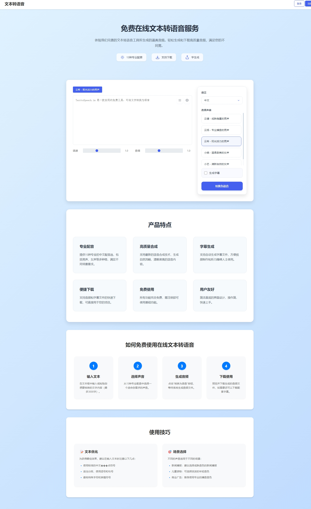

# Edge TTS Web

一个基于 Edge TTS 的在线文本转语音 Web 应用，提供简洁优雅的界面和专业的中文语音合成服务。

## 📸 界面预览

### 主界面

##接定制开发
## ✨ 功能特点

- 🎯 专业中文语音合成
  - 支持多个专业中文语音（包括男声、女声）
  - 自然流畅的语音效果
  - 可调节语速和音调

- 💎 现代化界面
  - 简洁优雅的用户界面
  - 响应式设计，支持移动端
  - 实时语音预览

- 🛠 实用功能
  - 支持生成字幕文件
  - 支持音频下载
  - 历史记录保存（需登录）

## 🚀 快速开始

### 环境要求

- Python 3.8+
- FastAPI
- edge-tts
- SQLite3

### 安装步骤

1. 克隆仓库
```bash
git clone https://github.com/D6397/edge-tts-web.git
cd edge-tts-web
```

2. 安装依赖
```bash
pip install -r requirements.txt
```

3. 运行应用
python run.py
```

4. 访问应用
打开浏览器访问 `http://localhost:8000`

## 📝 使用说明

1. 选择语音
   - 在右侧面板选择合适的语音
   - 可以试听不同声音的效果

2. 输入文本
   - 在文本框中输入需要转换的文字
   - 支持中文、英文等

3. 调整参数
   - 语速：0.5-2.0 倍速
   - 音调：0.5-2.0 倍
   - 可选择是否生成字幕

4. 生成语音
   - 点击"转换为语音"按钮
   - 等待转换完成
   - 下载音频或字幕文件

## 🔧 配置说明

### 环境变量

可以通过创建 `.env` 文件配置以下参数：

```env
DATABASE_URL=sqlite:///./sql_app.db
SECRET_KEY=your-secret-key
```

### 数据库配置

默认用 SQLite 数据库，数据库文件会自动创建在项目根目录。

## 👥 用户功能

- 注册/登录功能
- 历史记录保存
- 个人主页查看历史转换记录

## 📦 项目结构

```
edge-tts-web/
├── app.py              # 主应用文件
├── user_routes.py      # 用户相关路由
├── static/             # 静态文件
│   ├── css/           # 样式文件
│   ├── js/            # JavaScript 文件
│   ├── audio/         # 生成的音频文件
│   └── subtitles/     # 生成的字幕文件
├── templates/          # HTML 模板
└── requirements.txt    # 项目依赖
```

## 🤝 贡献指南

欢迎提交 Issue 和 Pull Request。在提交 PR 之前，请确保：

1. 更新了相关的文档
2. 添加了必要的测试
3. 通过了所有的测试

## 📄 开源协议

本项目采用 MIT 协议开源，详见 [LICENSE](LICENSE) 文件。
